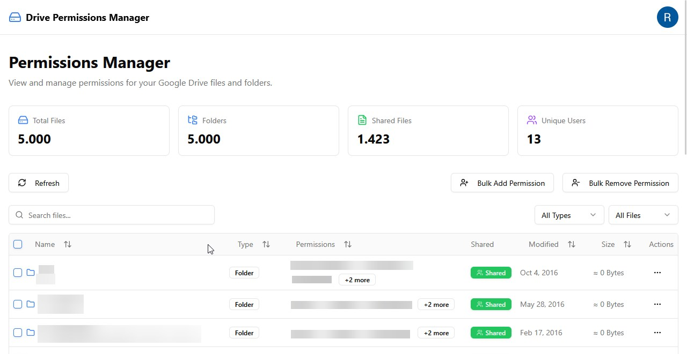

# Google Drive Permissions Manager

> 🤖 **Disclaimer: This project was built with AI assistance**

A powerful web application to visualize, manage, and audit file permissions across your entire Google Drive. Stop manually checking permissions on individual files—see everything in one dashboard.




## Features

- 📁 **Complete File Mapping** - Automatically scan and map your entire Google Drive structure
- 👥 **User-Based Permissions** - Add or remove access for specific users across multiple files
- 🔍 **Advanced Search & Filter** - Find files quickly with powerful search, sort, and filter capabilities
- 🎯 **Faceted Filtering** - Filter files by specific users with multi-select dropdowns
- ⚡ **Bulk Actions** - Manage permissions in bulk - grant or revoke access to hundreds of files
- 🔒 **Privacy First** - Offline-first with local IndexedDB storage
- 🔄 **Auto Token Refresh** - Seamless re-authentication when tokens expire
- 📊 **Permission Overview** - View all permissions at a glance with role-based badges

## Tech Stack

- **Framework**: [Next.js 16](https://nextjs.org/) (App Router)
- **UI Components**: [shadcn/ui](https://ui.shadcn.com/)
- **Data Table**: [TanStack Table v8](https://tanstack.com/table)
- **Authentication**: [NextAuth.js v5](https://authjs.dev/)
- **API**: [Google Drive REST API v3](https://developers.google.com/workspace/drive/api)
- **Local Storage**: [IndexedDB](https://developer.mozilla.org/en-US/docs/Web/API/IndexedDB_API) with [idb](https://github.com/jakearchibald/idb)
- **Styling**: [Tailwind CSS](https://tailwindcss.com/)
- **Icons**: [Lucide Icons](https://lucide.dev/)

## Prerequisites

- Node.js 18+
- npm, yarn, or pnpm
- Google Cloud Console project with Drive API enabled

## Getting Started

### 1. Clone the repository

```bash
git clone https://github.com/iamrenan/google-drive-permissions-manager.git
cd google-drive-permissions-manager
```

### 2. Install dependencies

```bash
npm install
```

### 3. Set up Google OAuth credentials

1. Go to [Google Cloud Console](https://console.cloud.google.com/)
2. Create a new project or select an existing one
3. Enable the **Google Drive API**
4. Go to **APIs & Services > Credentials**
5. Create an **OAuth 2.0 Client ID** (Web application)
6. Add authorized redirect URIs:
   - `http://localhost:3000/api/auth/callback/google` (development)
   - `https://yourdomain.com/api/auth/callback/google` (production)
7. Copy the **Client ID** and **Client Secret**

### 4. Configure environment variables

Copy `.env.example` to `.env.local` and fill in your credentials:

```bash
cp .env.example .env.local
```

Edit `.env.local` with your values:

```env
# Google OAuth credentials from step 3
GOOGLE_CLIENT_ID=your-client-id.apps.googleusercontent.com
GOOGLE_CLIENT_SECRET=your-client-secret

# NextAuth configuration
# Generate with: openssl rand -base64 32
NEXTAUTH_SECRET=your-random-secret-key-min-32-characters

# App URL
NEXTAUTH_URL=http://localhost:3000
```

**⚠️ Security**: Never commit `.env.local` to git. This file is already in `.gitignore`.

### 5. Run the development server

```bash
npm run dev
```

Open [http://localhost:3000](http://localhost:3000) in your browser.

## Project Structure

```
src/
├── app/
│   ├── api/
│   │   ├── auth/[...nextauth]/    # NextAuth.js routes
│   │   └── drive/                  # Drive API endpoints
│   │       ├── files/              # File listing endpoint
│   │       └── permissions/        # Permission management endpoints
│   ├── permissions/                # Permissions manager page
│   ├── layout.tsx                  # Root layout
│   └── page.tsx                    # Landing page
├── components/
│   ├── permissions/                # Permission-specific components
│   │   ├── columns.tsx             # TanStack Table column definitions
│   │   ├── data-table.tsx          # Data table component
│   │   ├── dialogs.tsx             # Modal dialogs
│   │   ├── empty-state.tsx         # Empty/loading states
│   │   ├── error-dialog.tsx        # Error handling dialog
│   │   └── faceted-filter.tsx      # Multi-select filter component
│   ├── ui/                         # shadcn/ui components
│   ├── auth-guard.tsx              # Authentication wrapper
│   ├── footer.tsx
│   ├── header.tsx
│   └── providers.tsx
├── hooks/
│   └── use-drive-files.ts          # Drive files hook with caching
└── lib/
    ├── auth.ts                     # NextAuth configuration
    ├── storage.ts                  # IndexedDB utilities
    ├── types.ts                    # TypeScript types
    ├── utils.ts                    # Utility functions
    └── validation.ts               # Input validation utilities
```

## Configuration

### File Mapping Threshold

To prevent resource exhaustion, the app limits file mapping to 5,000 files by default. You can adjust this in `src/lib/types.ts`:

```typescript
export const MAX_FILES_THRESHOLD = 5000;
```

### API Scopes

The app requests the following Google OAuth scopes:
- `https://www.googleapis.com/auth/drive` - Full access to all files in your Drive
- `https://www.googleapis.com/auth/drive.file` - Per-file access to files created or opened by the app

These scopes allow the app to read file metadata, view permissions, and modify permissions on your behalf.

## Deployment

### Vercel (Recommended)

1. Push your code to GitHub
2. Import the project to [Vercel](https://vercel.com)
3. Add environment variables in Vercel dashboard
4. Deploy!

### Other Platforms

Build the production version:

```bash
npm run build
npm start
```

## Contributing

Contributions are more than welcome! This is a personal project for learning purposes, so I may not review and respond as fast, but feel free to submit a Pull Request.

## License

This project is licensed under the MIT License - see the [LICENSE](LICENSE) file for details.

## Author

**Renan Aguiar** - [@iamrenan](https://github.com/iamrenan)

- GitHub: [github.com/iamrenan](https://github.com/iamrenan)
- LinkedIn: [linkedin.com/in/renan-aguiar](https://linkedin.com/in/renan-aguiar)

---

© Renan A / Aireworks, 2025. All rights reserved.
